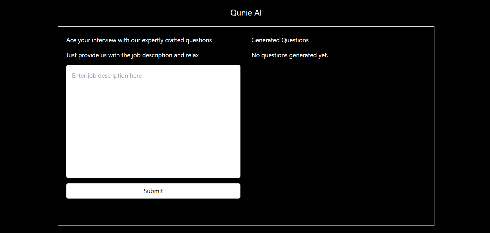

# AI-Powered Job Interview Coach

This project is an AI-powered job interview coach application that helps users prepare for job interviews. The app uses OpenAI's GPT-4 model to generate interview questions based on a provided job description. Users can input a job description and receive a set of customized interview questions to help them prepare effectively.

## Table of Contents

* [AI Model Used](#ai-model-used)
* [Features](#features)
* [Setup](#setup)
* [Usage](#usage)
* [API Endpoints](#api-endpoints)
* [License](#license)

## AI Model Used

The application leverages OpenAI's GPT-4 model to generate relevant interview questions based on the provided job description. The GPT-4 model is known for its advanced natural language understanding and generation capabilities, making it ideal for creating detailed and contextually appropriate interview questions.

## Features

* Generate interview questions based on job descriptions
* Display questions in a user-friendly format
* Clear input fields after submission
* Easy setup and integration

## Setup

### Prerequisites

* Node.js (v12.x or later)
* npm (v6.x or later)
* OpenAI API key

### Installation

1. **Clone the repository:**

   <pre class="!overflow-visible">

bash

<button class="flex gap-1 items-center py-1"><svg width="24" height="24" viewBox="0 0 24 24" fill="none" xmlns="http://www.w3.org/2000/svg" class="icon-sm"><path fill-rule="evenodd" clip-rule="evenodd" d="M7 5C7 3.34315 8.34315 2 10 2H19C20.6569 2 22 3.34315 22 5V14C22 15.6569 20.6569 17 19 17H17V19C17 20.6569 15.6569 22 14 22H5C3.34315 22 2 20.6569 2 19V10C2 8.34315 3.34315 7 5 7H7V5ZM9 7H14C15.6569 7 17 8.34315 17 10V15H19C19.5523 15 20 14.5523 20 14V5C20 4.44772 19.5523 4 19 4H10C9.44772 4 9 4.44772 9 5V7ZM5 9C4.44772 9 4 9.44772 4 10V19C4 19.5523 4.44772 20 5 20H14C14.5523 20 15 19.5523 15 19V10C15 9.44772 14.5523 9 14 9H5Z" fill="currentColor"></path></svg>Copy code</button>

<code class="!whitespace-pre hljs language-bash">git clone https://github.com/yourusername/ai-job-interview-coach.git
   cd ai-job-interview-coach
   </code>

</pre>
2. **Install dependencies:**

   <pre class="!overflow-visible">

bash

<button class="flex gap-1 items-center py-1"><svg width="24" height="24" viewBox="0 0 24 24" fill="none" xmlns="http://www.w3.org/2000/svg" class="icon-sm"><path fill-rule="evenodd" clip-rule="evenodd" d="M7 5C7 3.34315 8.34315 2 10 2H19C20.6569 2 22 3.34315 22 5V14C22 15.6569 20.6569 17 19 17H17V19C17 20.6569 15.6569 22 14 22H5C3.34315 22 2 20.6569 2 19V10C2 8.34315 3.34315 7 5 7H7V5ZM9 7H14C15.6569 7 17 8.34315 17 10V15H19C19.5523 15 20 14.5523 20 14V5C20 4.44772 19.5523 4 19 4H10C9.44772 4 9 4.44772 9 5V7ZM5 9C4.44772 9 4 9.44772 4 10V19C4 19.5523 4.44772 20 5 20H14C14.5523 20 15 19.5523 15 19V10C15 9.44772 14.5523 9 14 9H5Z" fill="currentColor"></path></svg>Copy code</button>

<code class="!whitespace-pre hljs language-bash">npm install
   </code>

</pre>
3. **Set up environment variables:**
   Create a `.env` file in the root directory and add your OpenAI API key:

   <pre class="!overflow-visible">

plaintext

<button class="flex gap-1 items-center py-1"><svg width="24" height="24" viewBox="0 0 24 24" fill="none" xmlns="http://www.w3.org/2000/svg" class="icon-sm"><path fill-rule="evenodd" clip-rule="evenodd" d="M7 5C7 3.34315 8.34315 2 10 2H19C20.6569 2 22 3.34315 22 5V14C22 15.6569 20.6569 17 19 17H17V19C17 20.6569 15.6569 22 14 22H5C3.34315 22 2 20.6569 2 19V10C2 8.34315 3.34315 7 5 7H7V5ZM9 7H14C15.6569 7 17 8.34315 17 10V15H19C19.5523 15 20 14.5523 20 14V5C20 4.44772 19.5523 4 19 4H10C9.44772 4 9 4.44772 9 5V7ZM5 9C4.44772 9 4 9.44772 4 10V19C4 19.5523 4.44772 20 5 20H14C14.5523 20 15 19.5523 15 19V10C15 9.44772 14.5523 9 14 9H5Z" fill="currentColor"></path></svg>Copy code</button>

<code class="!whitespace-pre hljs language-plaintext">OPENAI_API_KEY=your_openai_api_key_here
   </code>

</pre>
4. **Start the server:**

   <pre class="!overflow-visible">

bash

<button class="flex gap-1 items-center py-1"><svg width="24" height="24" viewBox="0 0 24 24" fill="none" xmlns="http://www.w3.org/2000/svg" class="icon-sm"><path fill-rule="evenodd" clip-rule="evenodd" d="M7 5C7 3.34315 8.34315 2 10 2H19C20.6569 2 22 3.34315 22 5V14C22 15.6569 20.6569 17 19 17H17V19C17 20.6569 15.6569 22 14 22H5C3.34315 22 2 20.6569 2 19V10C2 8.34315 3.34315 7 5 7H7V5ZM9 7H14C15.6569 7 17 8.34315 17 10V15H19C19.5523 15 20 14.5523 20 14V5C20 4.44772 19.5523 4 19 4H10C9.44772 4 9 4.44772 9 5V7ZM5 9C4.44772 9 4 9.44772 4 10V19C4 19.5523 4.44772 20 5 20H14C14.5523 20 15 19.5523 15 19V10C15 9.44772 14.5523 9 14 9H5Z" fill="currentColor"></path></svg>Copy code</button>

<code class="!whitespace-pre hljs language-bash">npm run dev
   </code>

</pre>

   This will start the server on `http://localhost:4000`.

## Usage

### Frontend

The frontend allows users to input a job description and submit it to generate interview questions.

* **Input Field:** Enter the job description.
* **Submit Button:** Click to submit the job description.
* **Generated Questions:** The questions will be displayed in a formatted manner on the right side of the screen.

### Backend

The backend handles the request to generate questions and communicates with the OpenAI API.

### Example Request

To generate interview questions, send a POST request to the `/generate-questions` endpoint with the job description in the request body.

#### Endpoint

`POST /generate-questions`

#### Request Body

<pre class="!overflow-visible">

json

<button class="flex gap-1 items-center py-1"><svg width="24" height="24" viewBox="0 0 24 24" fill="none" xmlns="http://www.w3.org/2000/svg" class="icon-sm"><path fill-rule="evenodd" clip-rule="evenodd" d="M7 5C7 3.34315 8.34315 2 10 2H19C20.6569 2 22 3.34315 22 5V14C22 15.6569 20.6569 17 19 17H17V19C17 20.6569 15.6569 22 14 22H5C3.34315 22 2 20.6569 2 19V10C2 8.34315 3.34315 7 5 7H7V5ZM9 7H14C15.6569 7 17 8.34315 17 10V15H19C19.5523 15 20 14.5523 20 14V5C20 4.44772 19.5523 4 19 4H10C9.44772 4 9 4.44772 9 5V7ZM5 9C4.44772 9 4 9.44772 4 10V19C4 19.5523 4.44772 20 5 20H14C14.5523 20 15 19.5523 15 19V10C15 9.44772 14.5523 9 14 9H5Z" fill="currentColor"></path></svg>Copy code</button>

<code class="!whitespace-pre hljs language-json">{
  "jobDescription": "Your job description here"
}
</code>

</pre>

#### Response

<pre class="!overflow-visible">

json

<button class="flex gap-1 items-center py-1"><svg width="24" height="24" viewBox="0 0 24 24" fill="none" xmlns="http://www.w3.org/2000/svg" class="icon-sm"><path fill-rule="evenodd" clip-rule="evenodd" d="M7 5C7 3.34315 8.34315 2 10 2H19C20.6569 2 22 3.34315 22 5V14C22 15.6569 20.6569 17 19 17H17V19C17 20.6569 15.6569 22 14 22H5C3.34315 22 2 20.6569 2 19V10C2 8.34315 3.34315 7 5 7H7V5ZM9 7H14C15.6569 7 17 8.34315 17 10V15H19C19.5523 15 20 14.5523 20 14V5C20 4.44772 19.5523 4 19 4H10C9.44772 4 9 4.44772 9 5V7ZM5 9C4.44772 9 4 9.44772 4 10V19C4 19.5523 4.44772 20 5 20H14C14.5523 20 15 19.5523 15 19V10C15 9.44772 14.5523 9 14 9H5Z" fill="currentColor"></path></svg>Copy code</button>

<code class="!whitespace-pre hljs language-json">{
  "response": "Generated questions based on the job description."
}</code>

</pre>

## License

This project is licensed under the MIT License. See the [LICENSE]() file for more information.

---

Yes, there were a few issues encountered during the setup process:

1. **API Key Configuration** :

* **Issue** : The application initially didn't recognize the OpenAI API key.
* **Resolution** : Ensured that the `.env` file was correctly set up with the `OPENAI_API_KEY` environment variable and that the `dotenv` package was properly configured to load the environment variables.

1. **CORS Issues** :

* **Issue** : The frontend had CORS (Cross-Origin Resource Sharing) issues when trying to communicate with the backend server.
* **Resolution** : Configured the backend server to handle CORS by using the `cors` middleware in the Express.js application.

<pre class="!overflow-visible">

javascript

<button class="flex gap-1 items-center py-1"><svg width="24" height="24" viewBox="0 0 24 24" fill="none" xmlns="http://www.w3.org/2000/svg" class="icon-sm"><path fill-rule="evenodd" clip-rule="evenodd" d="M7 5C7 3.34315 8.34315 2 10 2H19C20.6569 2 22 3.34315 22 5V14C22 15.6569 20.6569 17 19 17H17V19C17 20.6569 15.6569 22 14 22H5C3.34315 22 2 20.6569 2 19V10C2 8.34315 3.34315 7 5 7H7V5ZM9 7H14C15.6569 7 17 8.34315 17 10V15H19C19.5523 15 20 14.5523 20 14V5C20 4.44772 19.5523 4 19 4H10C9.44772 4 9 4.44772 9 5V7ZM5 9C4.44772 9 4 9.44772 4 10V19C4 19.5523 4.44772 20 5 20H14C14.5523 20 15 19.5523 15 19V10C15 9.44772 14.5523 9 14 9H5Z" fill="currentColor"></path></svg>Copy code</button>

<code class="!whitespace-pre hljs language-javascript">const cors = require('cors');
   app.use(cors());
   </code>

</pre>

1. **Response Parsing** :

* **Issue** : The JSON response from the OpenAI API needed to be properly formatted and parsed for display.
* **Resolution** : Implemented a function to handle the formatting of the response, ensuring that special characters and formatting like bold text were correctly displayed in the frontend.

### Did you find that the performance of some of these APIs is better than others for certain tasks?

While using the OpenAI API, several performance observations were made:

1. **Response Time** :

* The response time of the OpenAI GPT-4 model is generally acceptable for generating interview questions based on job descriptions. However, the response time can vary depending on the length and complexity of the input provided.

1. **Accuracy and Relevance** :

* The GPT-4 model provides highly accurate and relevant interview questions. Its advanced natural language understanding capabilities ensure that the generated questions are contextually appropriate and useful for interview preparation.
